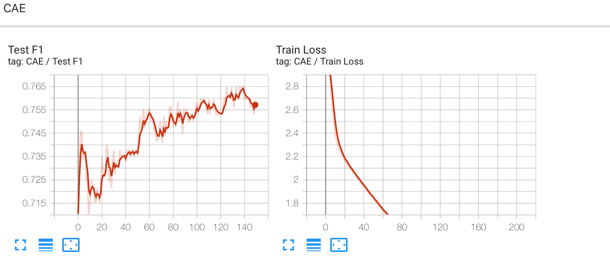

# Zero-bias CAE 

This repository implements code described in *Unsupervised Deep Transfer Feature Learning for Medical Image Classification* ([Paper Link](https://arxiv.org/abs/1903.06342)).

## Usage

### Dependency

Install required packages by `pip install -r requirement.txt`

### Baseline 

To check the baseline model performance, run `python run_baseline.py`		

### Train

Train the model by `cd Zero_bias_CAE` and `python run_cae.py`

### Note

This code experiments based on the dataset provided by this [repo](https://github.com/UCSD-AI4H/COVID-CT), and the split of training, validation and testing sets follows its instructions. For your convinience, the COVID-CT dataset and training log files can be downloaded [here](https://unisydneyedu-my.sharepoint.com/:f:/g/personal/hwan7885_uni_sydney_edu_au/EsgVKsuF12lNjY5Khxyc_68BTBoS_70IpCsHAn_E4Lc7eg?e=zLqbWp).

## Results

